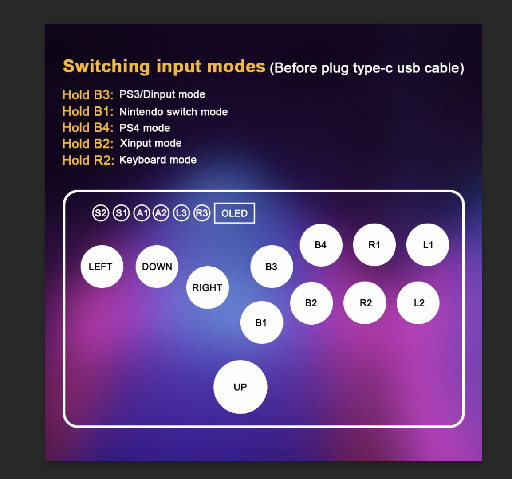
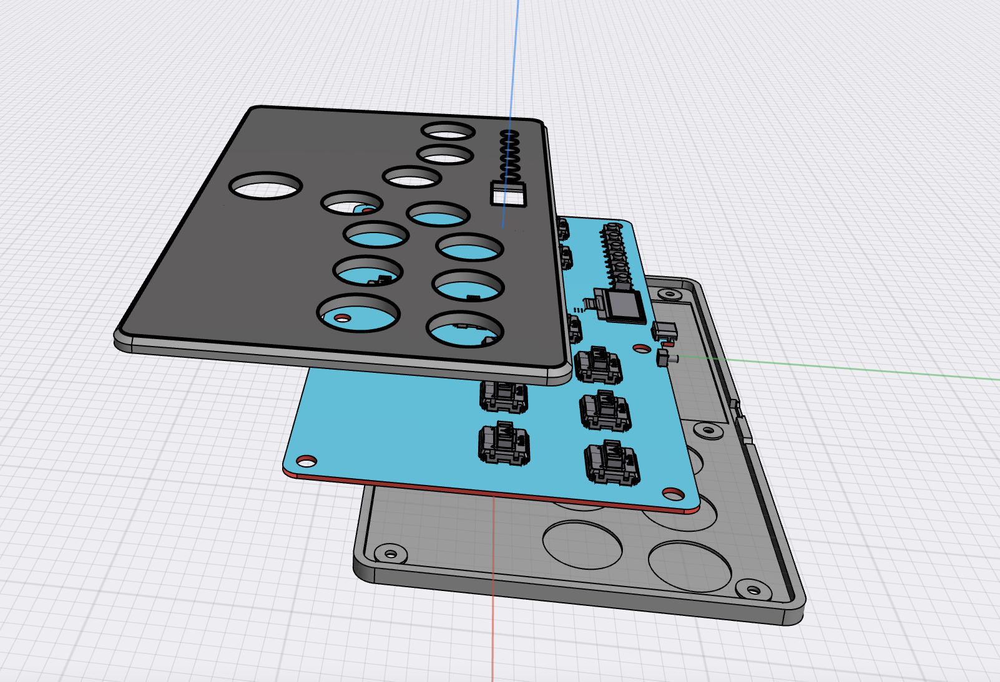

# Flatbox-LED 
Based on the [GP2040-CE](https://github.com/OpenStickCommunity/GP2040-CE) Flatbox Rev4

Add the colorful LEDs and the OLED display, perfect hardware change beased on the [Flatbox](https://github.com/jfedor2/flatbox) design by [jfedor2](https://github.com/jfedor2) powered by an RP2040 MCU.

